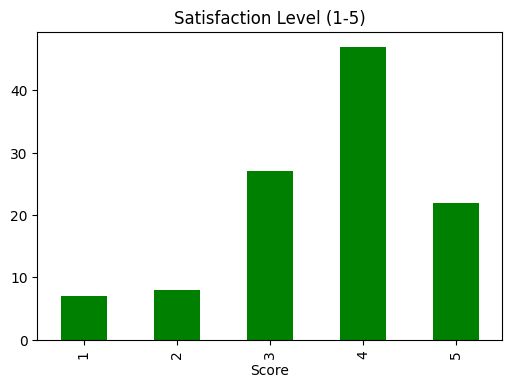

# Nandika Thapa – Finance & Economics Portfolio

Master's applicant in Finance/Economics | Empirical analysis of FinTech adoption in Nepal (pandas, seaborn).

## Key Project: Impact of FinTech on Traditional Banking in Nepal

- Primary survey (110+ responses).
- Findings: Convenience/speed dominate; ~90% reduced branch visits; satisfaction ~4/5; security/connectivity challenges.

[Open Notebook](FinTech_Survey_Analysis_Nepal.ipynb)

### Visualisations
  
  
  

Contact: nandikathapa4@gmail.com | LinkedIn: www.linkedin.com/in/
nandika-thapa

