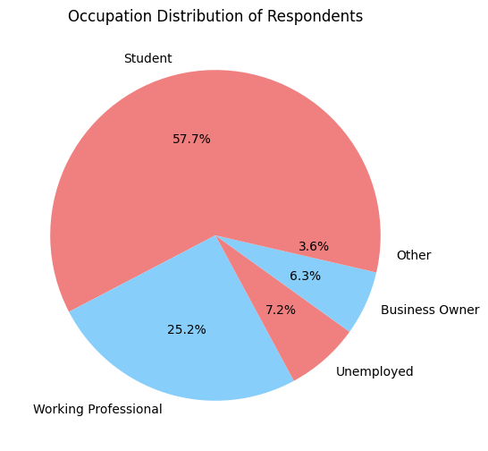
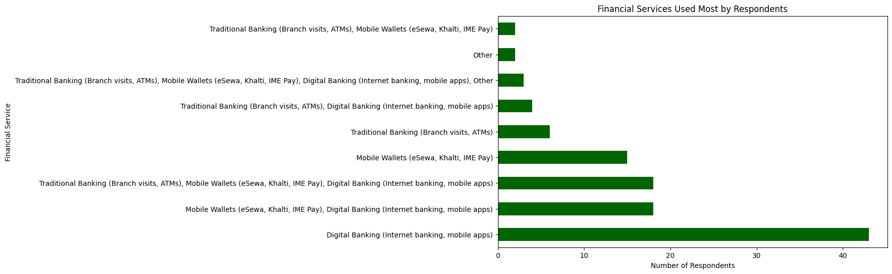
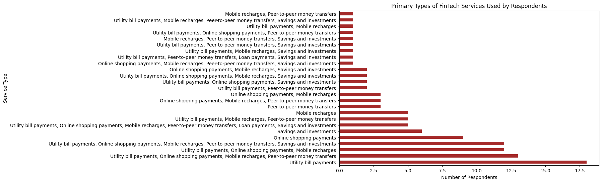
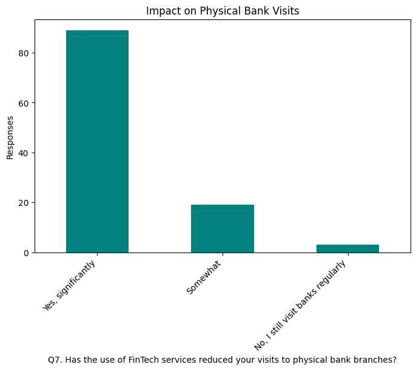
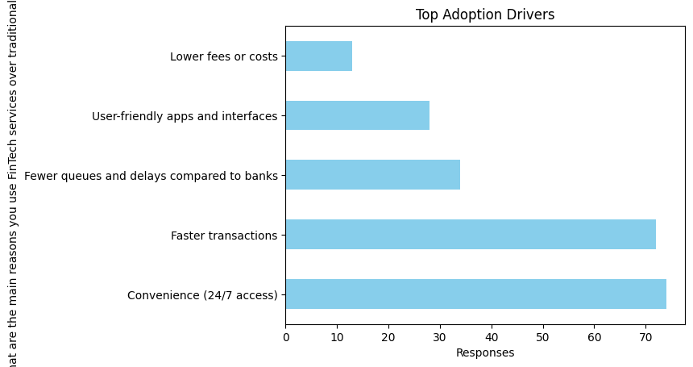
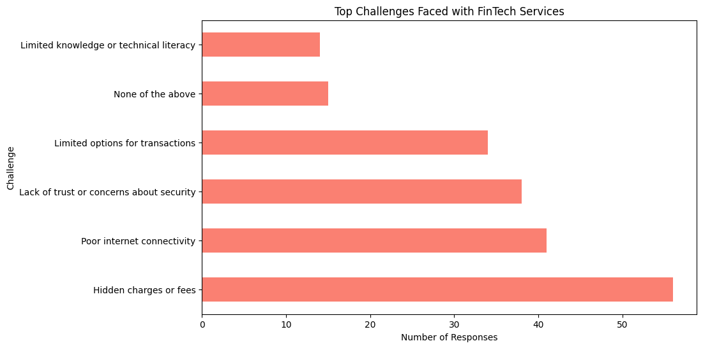
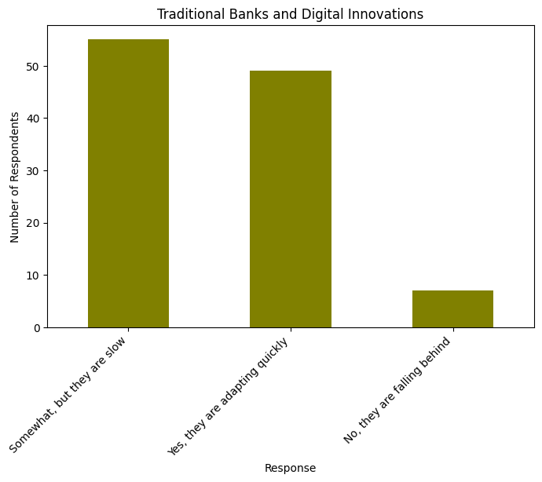

# Nandika Thapa – Finance & Economics Portfolio ([Connect on LinkedIn](https://www.linkedin.com/in/nandika-thapa))

**Overview
**
This project investigates the adoption and impact of FinTech services in Nepal’s banking sector using primary survey data (110+ responses). The analysis focuses on adoption drivers, user satisfaction, challenges, and the potential for FinTech to reduce physical bank visits.

Tools & Techniques: Python, pandas, seaborn, matplotlib, statsmodels, chi-square tests, logistic regression, econometric modeling.

**Key Contributions:
**
Designed and analyzed a primary survey targeting adoption, satisfaction, and challenges of FinTech services.
Created data visualizations (bar plots, pie charts, heatmaps) to communicate adoption patterns and challenges.
Conducted inferential statistics: Chi-square tests and logistic regression to identify drivers of reduced branch visits.
Addressed statistical modeling challenges such as quasi-separation in logistic regression, ensuring robust and interpretable odds ratios.

**Dataset
**Survey of 110+ respondents across different age groups, cities, occupations, and education levels.

**Questions covered:
**
Demographics (age, location, occupation, education)
FinTech usage frequency and types of services
Reasons for using FinTech vs. traditional banking
Satisfaction with FinTech services
Perceived reduction in physical bank visits
Future outlook of FinTech adoption in Nepal

[Open Interactive Notebook](FinTech_Survey_Analysis_Nepal.ipynb)

### Respondent Demographics
  
   

### Key Insights
  
  
  
  

Contact: nandikathapa4@gmail.com | LinkedIn: www.linkedin.com/in/
nandika-thapa

